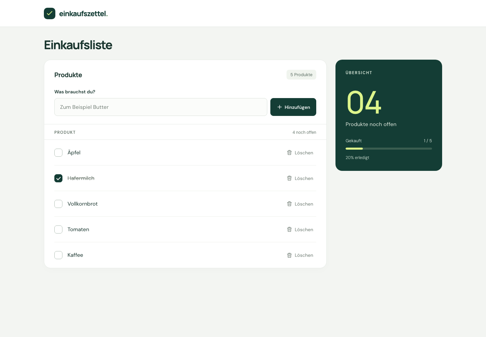

# Einkaufszettel

Eine Full-Stack-Einkaufsliste: Produkte hinzufügen, als gekauft markieren, wieder öffnen und löschen. Gekaufte Produkte werden durchgestrichen. Alle Änderungen werden in MongoDB gespeichert.

**Stack:** React 19 + TypeScript + Vite, Express 5 + TypeScript, MongoDB + Mongoose. Clientseitiger Zustand über `useState`, Datenladen über `useEffect`.

**UI-Bibliotheken:** Kein externes UI-Toolkit. Die Oberfläche verwendet semantisches HTML, eigenes CSS und kleine inline SVG-Icons. DM Sans und Manrope werden über die Fontsource-Pakete lokal ausgeliefert; es gibt keine externen Font-Requests. Zod validiert die API-Eingaben, Helmet setzt HTTP-Sicherheitsheader. Beide sind Backend-Bibliotheken, keine UI-Toolkits.



[Mobile Ansicht](docs/screenshots/mobile.png) · [Anforderungscheckliste](CHECKLIST.md)

## Voraussetzungen

- Node.js **22 ab 22.13** oder **24 und neuer** (Node 22 LTS empfohlen; `.nvmrc` liegt bei).
- npm (mit Node geliefert).
- MongoDB 7 oder neuer: über Docker Compose, lokal installiert oder MongoDB Atlas.

## Lokal starten

Im Stammverzeichnis des geklonten Repositorys:

```sh
npm ci
cp .env.example .env
docker compose up -d --wait
npm run dev
```

- Frontend: **http://127.0.0.1:5173**
- API: **http://127.0.0.1:3001/items**

`npm run dev` startet beide Anwendungen. Vite leitet `/items` an Express weiter. Änderungen an Frontend und Backend werden automatisch geladen. Die MongoDB-Daten liegen im benannten Docker-Volume `shopping-data` und bleiben bei einem normalen `docker compose down` erhalten.

**Ohne Docker:** Eine vorhandene MongoDB starten oder einen Atlas-Verbindungsstring in `.env` setzen; `docker compose up -d --wait` entfällt. Bei Atlas müssen der Datenbankbenutzer und der IP-Zugriff eingerichtet sein. Niemals Zugangsdaten committen.

| Variable | Standard | Zweck |
| --- | --- | --- |
| `MONGODB_URI` | `mongodb://127.0.0.1:27017/shopping_list` | Datenbank-Verbindung |
| `PORT` | `3001` | Express-Port |
| `HOST` | `127.0.0.1` | Bind-Adresse; für Container ggf. `0.0.0.0` |

Die `.env` wird unabhängig vom Arbeitsverzeichnis relativ zum Projektstamm geladen. Die Entwicklungsweiterleitung in `frontend/vite.config.ts` erwartet Port 3001; bei einer Änderung von `PORT` muss ihr Ziel entsprechend angepasst werden.

Der Docker-Start wartet mit `--wait` auf den MongoDB-Healthcheck. Dafür wird Docker Compose v2.20 oder neuer benötigt. Port 27017 muss frei sein; läuft dort bereits MongoDB, nutze diese Instanz mit passender `MONGODB_URI` und überspringe den Compose-Start.

## Produktionsbuild lokal prüfen

```sh
npm run build
npm start
```

MongoDB muss weiterhin laufen. Express liefert das gebaute Frontend und die API gemeinsam unter **http://127.0.0.1:3001** aus. Der Vite-Server wird dafür nicht benötigt. Läuft noch `npm run dev`, diesen vorher mit `Ctrl+C` beenden.

## Qualität prüfen

```sh
npm run check
npx playwright install chromium webkit
npm run test:e2e
```

`check` führt TypeScript-Prüfung, ESLint, API-Integrationstests und Produktionsbuild aus. Die Browsertests benötigen den gebauten Frontend-Stand (`npm run build`) und starten selbst ihren Testserver auf Port 4173. Desktop- und mobile Chromium-Ansichten sowie Desktop-WebKit prüfen den kompletten Ablauf, Fehlerzustände, Tastaturbedienung, lange Namen und axe-Regeln in Lade-, Leer-, Fehler- und gefüllten Zuständen sowie die Fokusführung bei verzögerten Antworten.

Beide Testsuiten starten über `mongodb-memory-server` einen **echten, isolierten MongoDB-Prozess**, keinen Datenbank-Mock. Die erste Ausführung lädt bei Bedarf eine MongoDB-Binärdatei; dafür ist Internet nötig. Tests verwenden weder `.env` noch die Entwicklungsdatenbank. Falls der Download im eigenen Netzwerk gesperrt ist, kann `MONGOMS_SYSTEM_BINARY=/absoluter/pfad/zu/mongod` gesetzt werden. Die Tests räumen ihre temporären Datenbanken anschließend auf.

Einzelbefehle: `npm run typecheck`, `npm run lint`, `npm test`, `npm run build`, `npm run test:e2e`. Playwright-Berichte und Screenshots werden unter `playwright-report/` bzw. `test-results/` erzeugt und nicht eingecheckt. Die CI führt dieselben Prüfungen auf Ubuntu aus. Safari als eigenständige App, Firefox, physische Mobilgeräte, MongoDB Atlas und ein manueller Screenreader-Audit gehören nicht zu diesem automatisierten Testumfang. Die Prüfung vergrößerter Schrift verwendet 200 % CSS-Grundschrift, keinen vollständigen Browser-Zoom-Audit.

Lokal geprüft am 29.09.2026: 29 API-Tests und 30 Browsertests bestanden. Ein frischer Setup mit `npm ci`, Compose und `npm run dev` wurde durchgespielt; Daten blieben nach `docker compose down` und erneutem Start erhalten. Auch `npm run build && npm start` wurde mit Chromium und WebKit gegen diese Datenbank geprüft.

## Struktur

```text
frontend/
  src/
    api/items.ts                  # HTTP-Zugriff und Prüfung der API-Antworten
    hooks/use-shopping-list.ts    # Laden, Mutationen und Status mit React-Hooks
    components/                  # Eingabeformular, Listeneintrag und Icons
    App.tsx                      # Seite und abgeleitete Einkaufsübersicht
    styles.css                   # Responsive Gestaltung und Fokuszustände
backend/
  src/
    models/shopping-item.ts      # Mongoose-Schema, daraus abgeleiteter TS-Typ
    routes/items.ts              # Vier REST-Endpunkte und Eingabevalidierung
    app.ts                       # Express-Middleware und Fehlerbehandlung
    server.ts                    # Konfiguration, MongoDB, Start und Shutdown
  tests/items.test.ts            # API-Integrationstests
e2e/                            # Isolierter Testserver und Browsertests
CHECKLIST.md                    # Anforderungen und Abnahmestand
```

## API

| Methode | Pfad | JSON-Body | Erfolg |
| --- | --- | --- | --- |
| `GET` | `/items` | – | `200` mit `ShoppingItem[]` |
| `POST` | `/items` | `{ "name": "Butter" }` | `201` mit neuem Eintrag und `Location`-Header |
| `PUT` | `/items/:id` | `{ "bought": true }` | `200` mit aktualisiertem Eintrag |
| `DELETE` | `/items/:id` | – | `204` ohne Body |

Ein Eintrag als JSON:

```json
{
  "_id": "507f1f77bcf86cd799439011",
  "name": "Butter",
  "bought": false,
  "createdAt": "2026-09-29T10:00:00.000Z"
}
```

In MongoDB sind `_id` ein `ObjectId` und `createdAt` ein `Date`. Beim JSON-Transport werden daraus Strings. Name und Status sind `string` bzw. `boolean`.

- Namen werden getrimmt und müssen anschließend 1–120 Zeichen lang sein. Doppelte Namen sind erlaubt.
- Neue Einträge erhalten `bought: false` und einen serverseitigen Erstellungszeitpunkt.
- Zusätzliche Body-Felder werden zurückgewiesen. Updates dürfen ausschließlich den Kaufstatus ändern.
- Einträge bleiben in Erstellungsreihenfolge, damit sie beim Abhaken nicht unter dem Mauszeiger oder Fokus wegspringen.
- Fehler liefern `{ "error": "Verständliche Nachricht" }`: `400` für ungültige Daten/IDs/JSON, `404` für fehlende Einträge, `413` für zu große Requests, `415` für nicht unterstützte Zeichensätze/Encodings, `500` für unerwartete Fehler. Interne Fehlermeldungen und Zugangsdaten werden nicht an den Browser weitergegeben.

Beispiel:

```sh
curl http://127.0.0.1:3001/items
curl -X POST http://127.0.0.1:3001/items \
  -H 'Content-Type: application/json' \
  -d '{"name":"Butter"}'
```

## Entscheidungen und Grenzen

Die Anwendung erfüllt bewusst einen kleinen Funktionsumfang. Ein eigener React-Hook genügt für diese einzelne Liste; ein globaler State-Manager oder eine zusätzliche Service-/Repository-Abstraktion würde hier wenig vereinfachen. Die Anzeige wird erst nach erfolgreicher Serverantwort verändert. Einträge können unabhängig voneinander gespeichert werden; weitere Aktionen am selben Eintrag sind währenddessen gesperrt. Die Einkaufsübersicht wird aus der Liste berechnet und besitzt keinen eigenen, potenziell widersprüchlichen Zustand.

Es gibt **keine Authentifizierung**: Alle Clients an derselben API verwenden dieselbe Liste. Änderungen anderer Browser erscheinen nach Neuladen. Es gibt keine Echtzeitsynchronisierung, Offline-Warteschlange oder Benutzertrennung. Nach einem Verbindungsabbruch kann eine Anfrage serverseitig bereits erfolgreich gewesen sein; die Oberfläche bietet deshalb ein erneutes Laden an. Für einen öffentlich zugänglichen Mehrbenutzerbetrieb wären insbesondere Zugriffsschutz und eine Zuordnung der Listen erforderlich.

Eine kompakte Erklärung der Entscheidungen findet sich in [docs/ARCHITECTURE.md](docs/ARCHITECTURE.md).
